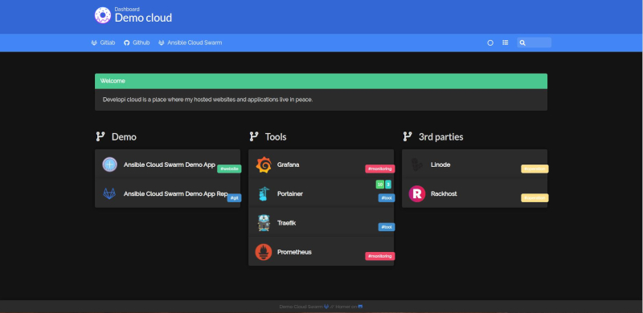
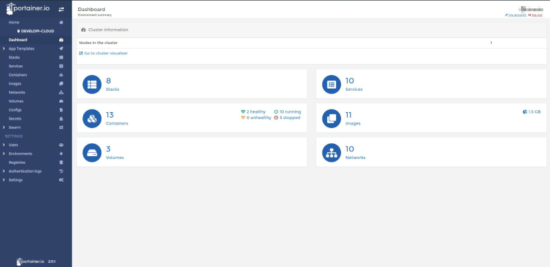
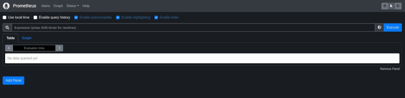

## Getting started
Prepare and maintain the manager and worker server's of the a cloud with ansible

### Requirements

1. Make sure ansible is installed. [Ansible Installation Guide](https://docs.ansible.com/ansible/latest/installation_guide/intro_installation.html)
2. Make sure dependencies are installed. Run `make idep`
3. A `.vault_pass` file with the vault passphrase is required in the root folder for ansible to decrypt the encrypted variables/files.
```echo "{some secret vault passphrase}" > .vault_pass```  
[Read more about ansible vault here](https://docs.ansible.com/ansible/latest/user_guide/vault.html)
1. At least one domain, which `.` and `*.` dns A records is redirected to the manager servers ip address.
2. Create your inventory and host_vars (using host_vars/default.yml)

## Playbooks

### Prepare - Prepare a fresh server for setup

First create the sysadmin users for maintanance.

> NOTE: this playbook will not be usable after the root login for ssh is disabled.

```
ansible-playbook prepare.yml [--limit <host_or_group_name>]

## or use the make shortcut
make prepare host=all
```

### Maintain - Setup (update) the server

> IMPORTANT: Before running this playbook make sure the host_vars contains the correct public keys, since those will be the only keys the server will have as authorized keys!

The playbook ensures that:

*  Timezone is set to Europe/Budapest
*  Sysadmin users are created
*  All required packages are installed and system is upgraded
*  Hosts files contains all nodes in the cluser
*  Login banner and message of the day is configured.
*  SSH is secured and configured. All authorized public keys are copied.
*  Firewall is enabled and configured
*  Docker and docker-compose are installed
*  Docker swarm Cloud is configured, nodes are joined
*  Ensure docker services are running and configured
     - Traefik
     - Portrainer
     - Prometheus
     - Grafana
     - Homer
     - Exporters for traefik, nodes and containers

```
ansible-playbook maintain.yml  [--limit <host_or_group_name>]

## or use the make shortcut
make maintain host=all
```

# Tools

## Homer


A place for all the links to easily access all tools and apps from one place.

## Traefik


Edge router for services.

## Portainer


A tool to manage docker services.

## Grafana


Visualizer for monitoring and alerts.

## Prometheus


A central storage for logs.

# Changelog
All notable changes to this project will be documented in this file.

The format is based on [Keep a Changelog](https://keepachangelog.com/en/1.0.0/),
and this project adheres to [Semantic Versioning](https://semver.org/spec/v2.0.0.html).

## [Unreleased]
   - Add GlusterFS to share volumes between nodes
   - Add fail2ban
   - Add ssh logging

## 1.0.0
   - Ensure users are configured on each node
   - Ensure all dependency packages are installed
   - Secure ssh config
   - Ensure firewall is configured
   - Install docker
   - Ensure docker swarm is configured and running
   - Join the nodes to the manager host
   - Ensure docker services are running and configured
     - Traefik
     - Portrainer
     - Prometheus
     - Grafana
     - Homer
     - Exporters for traefik, nodes and containers
